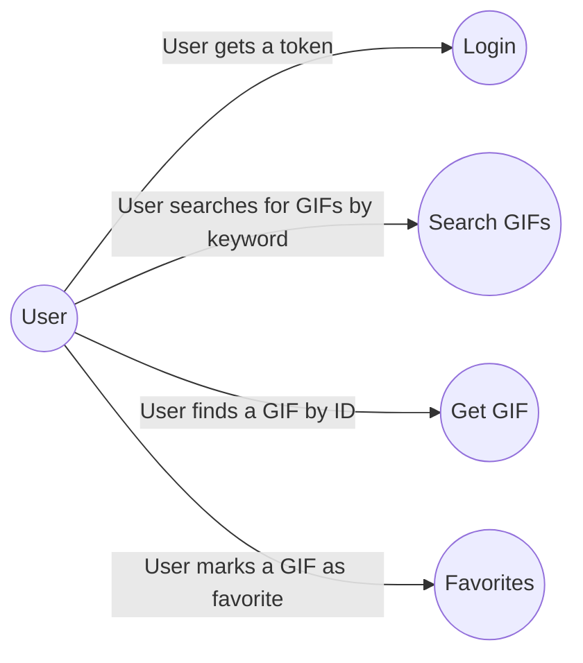
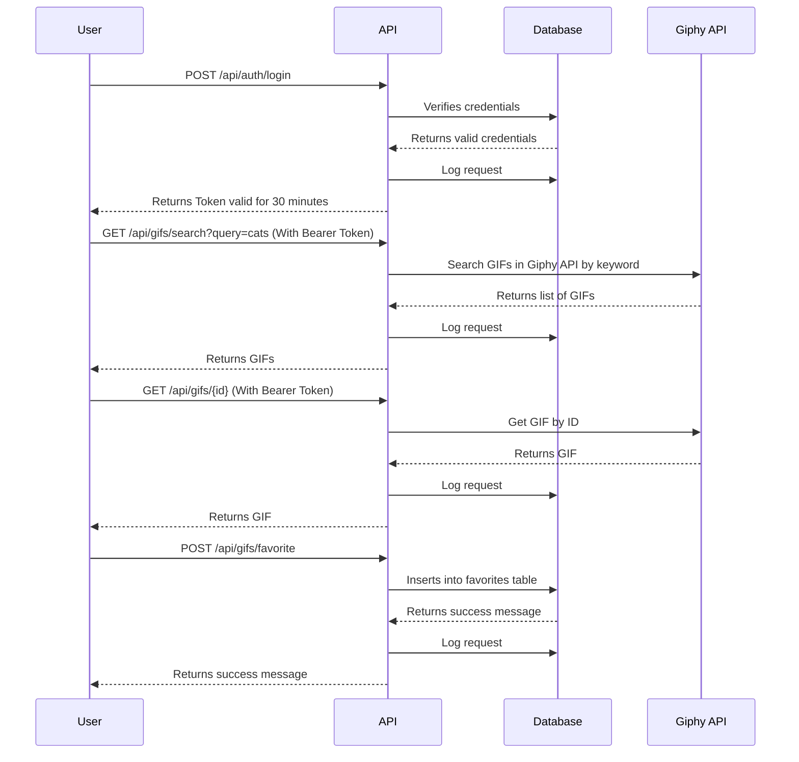
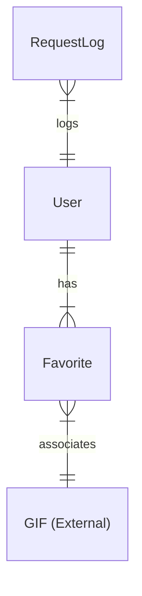

# giphy-api

## Project Deployment

1. **Clone the repository**:
   ```bash
   git clone https://github.com/enzonotario/giphy-api.git
   cd giphy-api
   ```
1. Install dependencies:

    ```bash
    composer install
    ```

1.  Create the .env file:

    ```bash
    cp .env.example .env
    ```

1.  Generate the application key:

    ```bash
    php artisan key:generate
    ```
    
1. Edit the .env file and set the following variables:

    ```bash
    GIPHY_API_KEY=YOUR_GIPHY_API_KEY
    ```

1.  Start the development server:
    
    Using Makefile:

    ```bash
    make up
    ```
    
    Or manually:

    ```bash
    ./vendor/bin/sail up -d
    ```
    
1.  Run initial setup:

    Using Makefile:

    ```bash
    make install
    ```
    
    Or manually:

    ```bash
    ./vendor/bin/sail exec laravel.test php artisan migrate
	./vendor/bin/sail exec laravel.test php artisan passport:keys
    ```

1.  Run the tests:

    Using Makefile:

    ```bash
    make test
    ```
    
    Or manually:

    ```bash
    ./vendor/bin/sail exec laravel.test php artisan test
    ```
    
7.  Fresh the database:

    Using Makefile:

    ```bash
    make fresh
    ```
    
    Or manually:

    ```bash
    ./vendor/bin/sail exec laravel.test php artisan migrate:fresh --seed
    ```

## Use Cases



## Sequence Diagrams



## Data Diagram



## Postman Collection

You can find the Postman Collection [here](./giphy-api.postman_collection.json).
